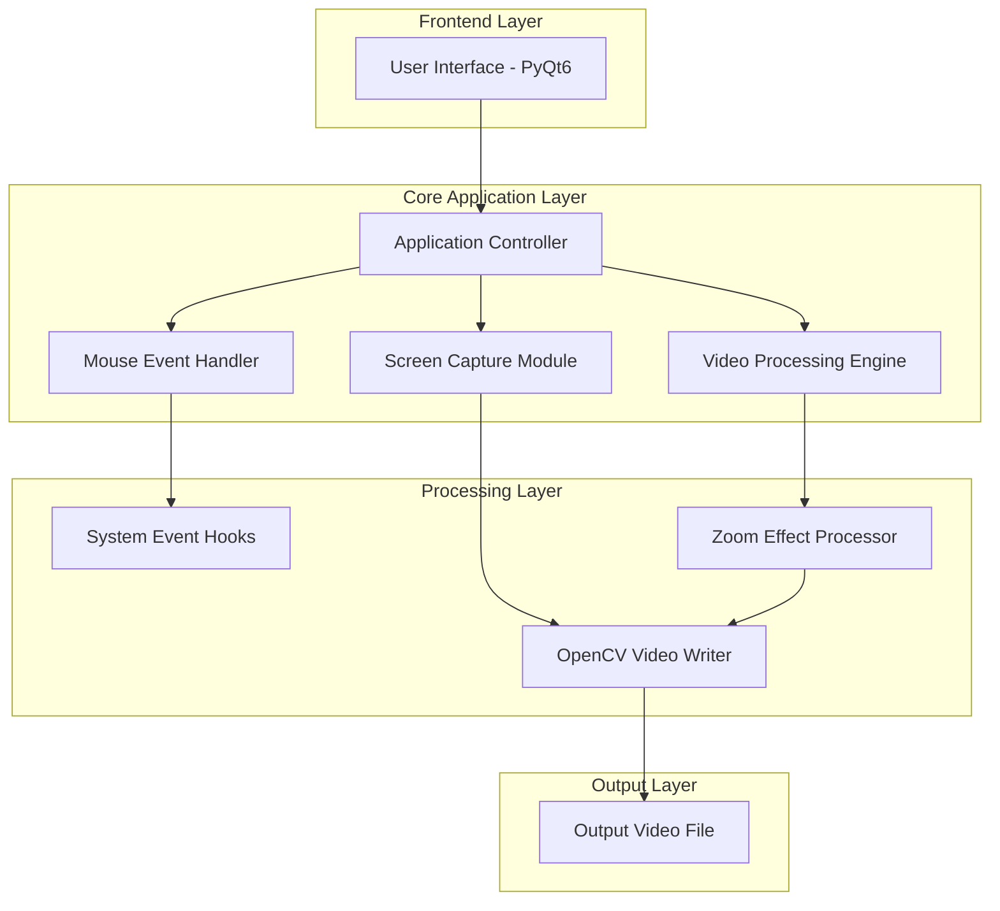
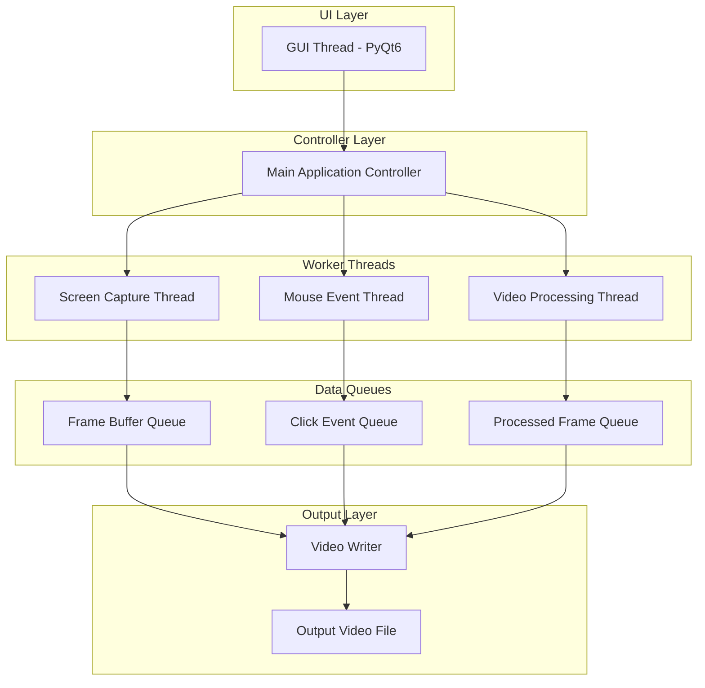
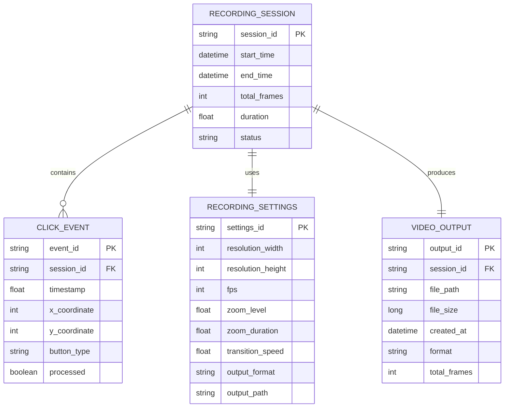

# Pinpoint Capture - Technical Architecture Document

## 1. Architecture Design



## 2. Technology Description

- Frontend: PyQt6 + Python 3.9+
- Core Libraries: OpenCV 4.8+, NumPy 1.24+, Pillow 10.0+
- System Integration: pynput 1.7+ (mouse/keyboard hooks), mss 9.0+ (screen capture)
- Video Processing: opencv-python, moviepy 1.0+ (post-processing)
- Threading: concurrent.futures (async processing)

## 3. Route Definitions

As a desktop application, routes are replaced by main application windows and dialogs:

| Window/Dialog | Purpose |
|---------------|----------|
| MainWindow | Primary application interface with recording controls and preview |
| SettingsDialog | Configuration window for zoom parameters and recording settings |
| PreviewWindow | Full-screen preview mode during recording |
| AboutDialog | Application information and help documentation |

## 4. API Definitions

### 4.1 Core Application APIs

**Screen Capture Interface**
```python
class ScreenCapture:
    def start_capture(self, region: Optional[Tuple[int, int, int, int]] = None) -> bool
    def stop_capture(self) -> None
    def get_frame(self) -> np.ndarray
```

**Mouse Event Handler**
```python
class MouseEventHandler:
    def start_monitoring(self) -> None
    def stop_monitoring(self) -> None
    def get_click_events(self) -> List[ClickEvent]
```

**Video Processing Engine**
```python
class VideoProcessor:
    def apply_zoom_effect(self, frame: np.ndarray, click_point: Tuple[int, int], zoom_level: float) -> np.ndarray
    def create_transition(self, start_frame: np.ndarray, end_frame: np.ndarray, progress: float) -> np.ndarray
    def save_video(self, frames: List[np.ndarray], output_path: str, fps: int) -> bool
```

**Configuration Manager**
```python
class ConfigManager:
    def load_settings(self) -> Dict[str, Any]
    def save_settings(self, settings: Dict[str, Any]) -> bool
    def get_default_settings(self) -> Dict[str, Any]
```

### 4.2 Data Models

**ClickEvent Model**
```python
@dataclass
class ClickEvent:
    timestamp: float
    x: int
    y: int
    button: str  # 'left', 'right', 'middle'
    screen_resolution: Tuple[int, int]
```

**RecordingSettings Model**
```python
@dataclass
class RecordingSettings:
    resolution: Tuple[int, int]  # (1920, 1080)
    fps: int  # 30 or 60
    zoom_level: float  # 1.5 to 5.0
    zoom_duration: float  # 1.0 to 10.0 seconds
    transition_speed: float  # 0.1 to 2.0
    output_format: str  # 'mp4', 'avi'
    output_path: str
    auto_save: bool
```

## 5. Server Architecture Diagram



## 6. Data Model

### 6.1 Data Model Definition



### 6.2 Data Definition Language

**Application Configuration (JSON-based local storage)**
```json
{
  "recording_settings": {
    "resolution": [1920, 1080],
    "fps": 30,
    "zoom_level": 2.0,
    "zoom_duration": 3.0,
    "transition_speed": 1.0,
    "output_format": "mp4",
    "output_path": "./recordings",
    "auto_save": true
  },
  "ui_settings": {
    "window_geometry": [100, 100, 800, 600],
    "theme": "light",
    "preview_enabled": true
  },
  "advanced_settings": {
    "buffer_size": 100,
    "compression_quality": 85,
    "click_detection_sensitivity": 0.5
  }
}
```

**Session Data Structure (Runtime)**
```python
# Session tracking for active recordings
session_data = {
    "session_id": "rec_20241201_143022",
    "start_time": 1701434622.123,
    "frames": [],  # List of captured frames
    "click_events": [],  # List of ClickEvent objects
    "settings": RecordingSettings(),
    "status": "recording"  # 'idle', 'recording', 'processing', 'completed'
}
```