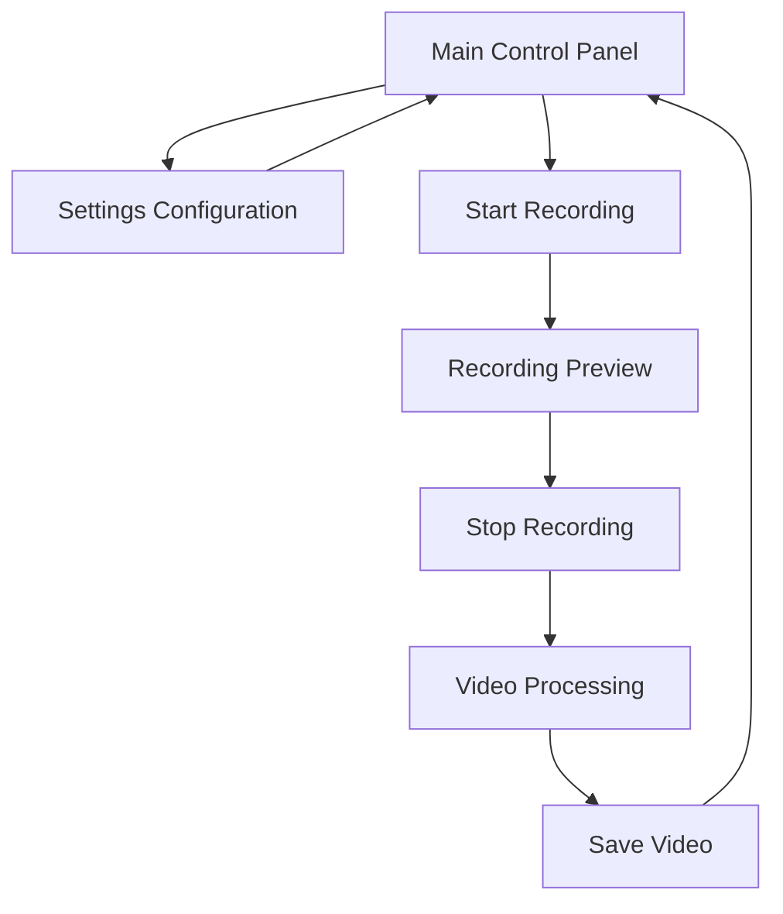

# Pinpoint Capture - Screen Recorder with Smart Zoom

## 1. Product Overview
Pinpoint Capture is a Python-based screen recording application that automatically zooms in on areas where users click during recording, creating engaging and focused video content.

The application solves the problem of creating clear, focused screen recordings by automatically highlighting user interactions through intelligent zoom effects, making it ideal for tutorials, demonstrations, and presentations.

## 2. Core Features

### 2.1 User Roles
This application does not require user role distinctions as it's a single-user desktop application.

### 2.2 Feature Module
Our screen recorder application consists of the following main pages:
1. **Main Control Panel**: recording controls, settings panel, preview window
2. **Settings Configuration**: zoom parameters, recording quality, output settings
3. **Recording Preview**: real-time recording preview, zoom effect visualization

### 2.3 Page Details

| Page Name | Module Name | Feature description |
|-----------|-------------|---------------------|
| Main Control Panel | Recording Controls | Start/stop recording, pause/resume functionality, recording timer display |
| Main Control Panel | Settings Panel | Quick access to zoom sensitivity, recording quality, output format selection |
| Main Control Panel | Preview Window | Real-time display of current screen with zoom effects preview |
| Settings Configuration | Zoom Parameters | Configure zoom level (1.5x to 5x), zoom duration (1-10 seconds), transition speed |
| Settings Configuration | Recording Quality | Set resolution (720p, 1080p, 4K), frame rate (30/60 fps), compression settings |
| Settings Configuration | Output Settings | Choose save location, file format (MP4, AVI), auto-save options |
| Recording Preview | Live Preview | Show current recording with zoom effects in real-time |
| Recording Preview | Click Visualization | Highlight mouse clicks with visual indicators during recording |

## 3. Core Process

**Main User Flow:**
1. User launches the application and sees the main control panel
2. User configures recording settings (zoom level, quality, output location)
3. User clicks "Start Recording" to begin screen capture
4. During recording, the application detects mouse clicks and applies zoom effects automatically
5. User clicks "Stop Recording" to end the session
6. Application processes the video with zoom effects and saves to specified location
7. User can preview the final video or start a new recording session

## 4. User Interface Design

### 4.1 Design Style
- **Primary Colors**: Deep blue (#2563eb) for main elements, green (#16a34a) for recording indicators
- **Secondary Colors**: Light gray (#f8fafc) for backgrounds, red (#dc2626) for stop/danger actions
- **Button Style**: Rounded corners with subtle shadows, flat design with hover effects
- **Font**: Segoe UI (Windows) / SF Pro (Mac) / Ubuntu (Linux), sizes 12px-18px
- **Layout Style**: Clean, minimal interface with card-based sections and top navigation
- **Icons**: Outline style icons for controls (play, stop, settings, zoom)

### 4.2 Page Design Overview

| Page Name | Module Name | UI Elements |
|-----------|-------------|-------------|
| Main Control Panel | Recording Controls | Large circular record button (red when recording), rectangular stop/pause buttons, digital timer display with monospace font |
| Main Control Panel | Settings Panel | Collapsible sidebar with sliders for zoom settings, dropdown menus for quality, toggle switches for auto-save |
| Main Control Panel | Preview Window | Bordered preview area (16:9 aspect ratio), zoom indicator overlay, click markers with fade animation |
| Settings Configuration | Zoom Parameters | Range sliders with value labels, preview demonstration area, reset to defaults button |
| Settings Configuration | Recording Quality | Radio buttons for resolution, dropdown for frame rate, progress bar for compression level |
| Recording Preview | Live Preview | Full-screen preview mode option, zoom level indicator, recording status overlay |

### 4.3 Responsiveness
Desktop-first application optimized for Windows, macOS, and Linux. Minimum window size 800x600px with scalable UI elements for different screen resolutions.